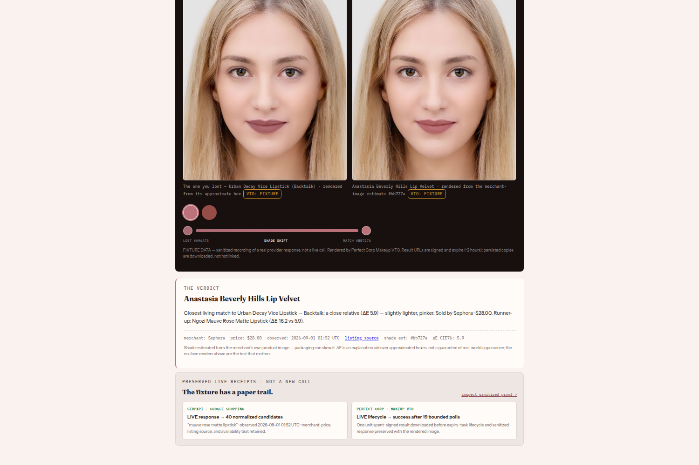
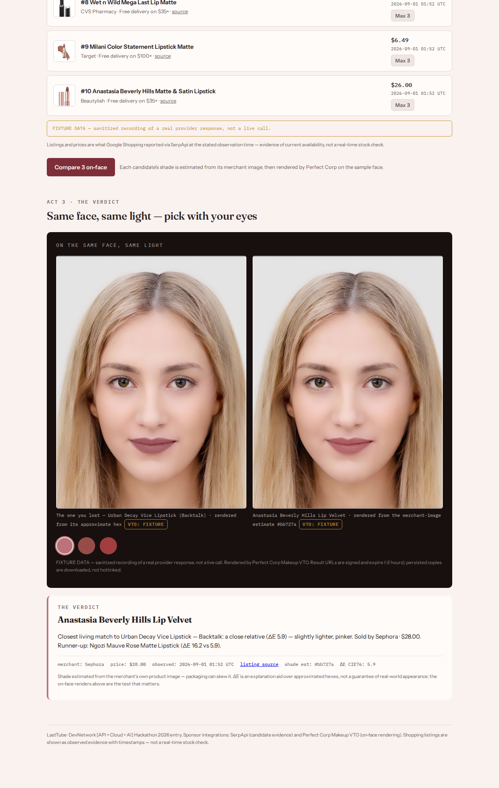
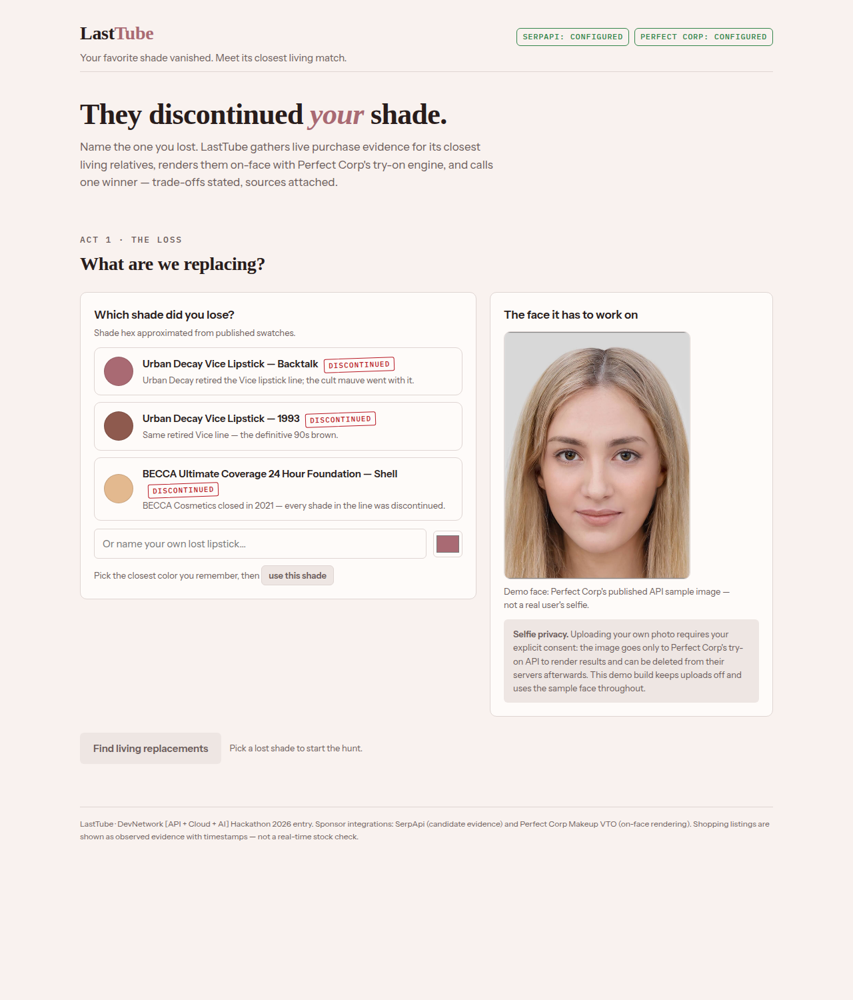
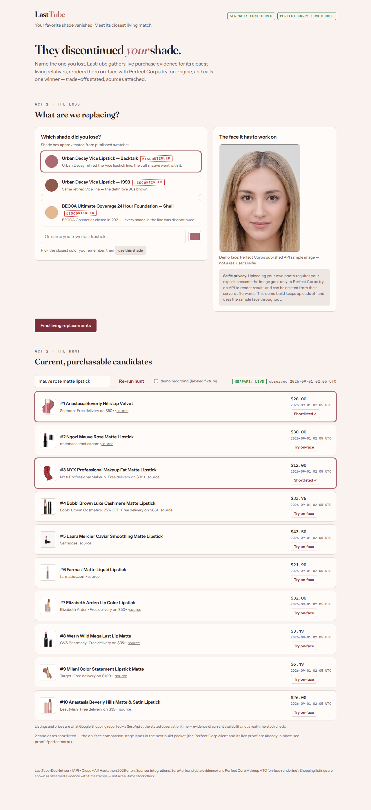

# LastTube

**Your favorite shade vanished. LastTube finds currently listed replacements, shows them on your face, and explains the closest match.**

The loop: **discontinued favorite → live purchase evidence → on-face comparison → one source-backed verdict with an explicit trade-off.**

Built for the DevNetwork [API + Cloud + AI] Hackathon 2026 with both sponsor technologies load-bearing in the judged hero flow:

- **SerpApi** (Google Shopping engine) discovers currently listed replacement candidates with merchant, price, availability text, source links, and observation timestamps.
- **Perfect Corp Makeup VTO** renders every comparison through the real async lifecycle: `POST /s2s/v2.0/task/makeup-vto` → bounded polling → signed result download.



## How it works

1. **The loss** — pick a real discontinued favorite (Urban Decay's retired Vice line, BECCA's closed catalog) or name your own and set its approximate hex.
2. **The hunt** — one live SerpApi `google_shopping` search becomes an evidence panel: each row keeps merchant, price, the availability text the source actually reported, a source link, and the observation time. Copy states plainly that a listing is evidence of current availability, **not a real-time stock check**.
3. **The verdict** — each shortlisted candidate's shade is **estimated from the merchant's own product image** (dominant saturated color, background-filtered, method disclosed), rendered on the same sample face by Perfect Corp, and scored against the lost shade in CIE Lab. One winner is named with a plain-language trade-off ("a close relative (ΔE 5.9) — slightly lighter, pinker"), a runner-up delta, and a receipt strip.

The interface itself is tinted by the shade under consideration (`--shade`), so the product's subject — the color — is the one bold element on the page.

## Provider honesty

Every provider result is stamped `live | fixture | unavailable | failed` and the stamp is rendered next to the data it describes. Demo mode replays **recordings of real, receipted provider lifecycles** (task ids and poll counts preserved) and labels every surface `FIXTURE` — it cannot masquerade as live. Missing evidence is disclosed as missing, never fabricated.



## Architecture

```
Vite + React client (src/)
  Act 1 input → Act 2 evidence panel → Act 3 VTO stage + verdict
        │  /api/* only — no secrets in the browser
        ▼
Hono on Node (server/)
  /api/search                → SerpApi google_shopping → typed CandidateRecords
  /api/shade-estimate        → sharp: dominant saturated color of merchant image
                               (https + host allowlist, size cap)
  /api/vto                   → Perfect Corp makeup-vto: create → bounded poll
                               (2s interval, <10s gap, 120s budget) → result
  /api/demo/comparison-bundle→ labeled replay of recorded real lifecycles
        │
        ▼
shared/ (types.ts, color.ts, effects.ts)
  provider-status contract · hex→Lab(D65) · CIE76 ΔE · trade-off wording
proofs/ — sanitized live-call receipts (committed evidence)
```

## Setup

```bash
npm install
cp .env.example .env   # fill in SERPAPI_KEY and PERFECT_CORP_API_KEY
```

Without keys the API reports providers as `unavailable` — it never fakes live data. Demo mode still works.

## Run

```bash
npm run dev:api   # API on http://localhost:8787
npm run dev       # web client on http://localhost:5173 (proxies /api)
```

## Verify (no network needed)

```bash
npm run verify    # typecheck + lint + 29 offline tests + build + secret scan
```

## Rehearse the judge demo (no network or provider spend)

```bash
npm run build
npm run capture:demo
```

The capture command starts the production-built app, opens `/?mode=demo` in the installed Chrome,
drives Backtalk through a two-candidate verdict, and writes six screenshots under
`docs/screenshots/`. It fails if the browser attempts a live SerpApi, Perfect Corp, or merchant-image
request, if fixture rows render remote product thumbnails, if any non-local image is requested, if
fewer than three `FIXTURE` badges render, if the browser reports an error, or if the mobile verdict
overflows horizontally. Fixture listing thumbnails are deliberately replaced by local `REC`
placeholders; the merchant image URLs remain in the sanitized receipt, but the judge-demo pixels do
not depend on them. Set `CHROME_PATH` only when Chrome is installed elsewhere.

## Deployment shape (human gate)

The production server serves both `dist/` and `/api/*` from one process:

```bash
npm run build
npm run start       # http://localhost:8787
```

`Dockerfile` and `render.yaml` are a reversible judge-preview adapter. The Blueprint disables
automatic deploys and declares both provider secrets as dashboard-entered values (`sync: false`).
Creating the Render service, entering secrets, and making the URL public are intentionally left to
the operator. See Render's official [Blueprint specification](https://render.com/docs/blueprint-spec)
and [health-check contract](https://render.com/docs/health-checks).

## Live provider proof (opt-in, spends quota)

```bash
npm run proof:serpapi       # 1 real google_shopping search -> proofs/serpapi/
npm run proof:perfectcorp   # 1 real makeup-vto lifecycle   -> proofs/perfectcorp/
npx tsx scripts/build-demo-bundle.ts   # re-record the labeled demo bundle
```

Receipts are sanitized before writing: credential values, `api_key` params, and signed-URL query material are redacted; result images are downloaded because Perfect Corp signed URLs expire (~2 hours). The committed receipts include the full task lifecycle (task id, poll count, credit balance before/after).

## Honesty notes

- Shopping listings are **observed evidence with timestamps**, not stock guarantees; the copy says so wherever they appear.
- Candidate shades are **estimates from merchant product images** — packaging can skew them; the method and its limits are disclosed in the verdict.
- ΔE is an explanation aid over approximated hexes, not a promise of real-world appearance — the on-face renders are the test that matters.
- Preset "lost shade" hexes are labeled as approximations from published swatches.

## Privacy

No real person's selfie is used anywhere in this repository or demo. The demo face is Perfect Corp's own published API sample image, and the consent policy for future selfie upload is stated in the product.

## Screenshots

| Act 1 — the loss | Act 2 — the hunt |
| --- | --- |
|  |  |
